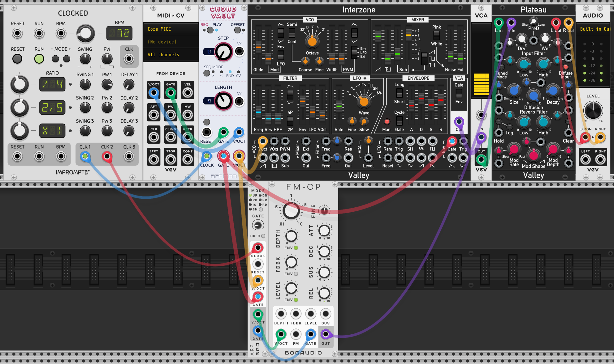
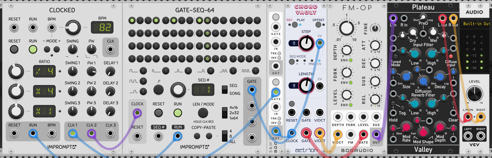

# aetrion-modular
aetrion VCV Rack modules

# Chord Vault

Chord Vault is a chord sequencer with a little twist.
Record polyphonic cv/gate pairs into up to 16 steps and choose from a one of 8 sequencing modes.
Its main purpose is to be an easy way for playing chords on a midi keyboard and "saving" the notes for playback.
But of course you can hook up anything that sends gates and cv. Or just use one of the presets as a shortcut.

## Quick Start

[Download Quick Start](./examples/ChordVault_QuickStart.vcv?raw=true)

This quick example shows the **basic routing** for polyphonic note input from a midi keyboard. If you understand this basic concept you can of course work without midi input.
Note that the default polyphony is set to 5 (can be changed in right click menu).

1. Make sure the module is in RECORD State (**REC**, top left button).
2. Play a chord. You'll hear it while keys are pressed. Notice how the module auto advances to the next step once you let go of the keys (step number increases by one).
3. After you played in a few chords, switch module to PLAY state (**PLAY**, top button).
4. Start the CLOCKED Module by pressing the run button
5. Your chords will play in order (first SEQ Mode). Use SEQ MODE button to play around with different modes

*Quick Note on setup for the MIDI > CV module: Use right click menu to set number of polyphony channels "going into" chord vault and also make sure to select polyphony mode option called "reset". This ensures a clean input for each step.*

## Panel

1. **REC / PLAY State:** Switches between both states, with REC being used to input notes and PLAY turning on the sequencer (if a clock signal is present)
	- REC Status behavior: as long as gate is high, all notes played are recorded into the current step (up to max. number of poly channels defined), the module auto advances to the next step when gate is low.
	- PLAY Status behavior: when CLOCK is unpatched or not running you can manually go through each step by turning the STEP knob
2. **STEP knob and display:** display shows currently selected or active step, knob automatically moves to further indicate the current step.
	- STEP knob behavior: manually select a step in REC status to record into it (or replace step content), manually select a step to audition steps (works in PLAY mode too when clock is stopped)
3. **STEP CV input:** Used exclusively with the corresponding SEQ Mode "CV" to change step number based on CV input (0-5V default, see SEQ mode list below)
4. **SEQ button and LEDs:** cycles through different SEQ modes (explained below), LED shows currently active mode
5. **LENGTH knob and display:** display shows currently selected length, knob manually selects a sequence length independent of how many steps have content recorded into them
6. **LENGTH CV input:** change sequence length via CV (0-5V default, with 0V being 1 step and 5 being 16 steps seq length)
7. **RESET Button and input:** Resets the sequencer to the first step (which may not be step 1 depending on SEQ mode), input uses trigger or gate
8. **GATE input:** Polyphonic gate input, number of channels needs to match number of polyphony channels set in ChordVault (Right-Click Menu) or you'll not get all notes into the step as expected. if you have a mono gate, use a module like [BOGAUDIO POLYMULT](https://library.vcvrack.com/Bogaudio/Bogaudio-PolyMult) to "duplicate" the gate across the correct number of channels. Incoming gate length should be 1ms or more, but is not relevant to playback (see 11. Gate Output)
9. **V/OCT input:** Polyphonic CV (1V/Oct) input, records incoming CV while gate input is high 
10. **CLOCK Input:** Advances the sequencer to the "next" step or retriggers gate for current step (depending on SEQ mode), clock is only active in PLAY status
11. **Gate Output:** Polyphonic Gate signal to attach to a voice or envelope generator. Gate length is dependent of clock pulse length (fun to play around with, gate is high as long as clock input is high)
12. **V/OCT Output:** Polyphonic CV (1V/Oct) output with notes ordered from low to high. If you have a chord that doesn't use all poly channels, notes from the previous chords may be carrying over to help with longer env release times (not cutting notes off).
13. **Offset Mode Button:** activates offset mode. change the first step in the sequence (range) by manually turning the step knob. note that the step knob no longer "animates" so you can easily change the offset during playback.

## SEQUENCE MODES
*Notice that step selection is **always dependent on the sequence length** set by the length knob (or length cv).*

### Default Modes (blue led)
1. **Forward ( > )** - Plays steps in regular order (low to high numbers).
2. **Backward ( < )** - Plays steps in reverse order (high to low numbers).
3. **Random ( RND )** - Randomized step selection (without step repeats).
4. **CV Control ( CV )** - Special mode that let's you select steps via CV. Needs a **CV input signal** patched to the jack and uses unipolar 0-5V range to select from steps *with respect to the seq length*. 
**CV Control clock behavior:** Sample & Hold, so you may retrigger a current step with an additional clock pulse, while step CV input is unchanged. Changes in step CV input are sent to output "together" with the clock. 
### Special Modes (pink led)
Press and hold the SEQ button for 1 second to access these modes. You can also access them using the right click menu which also shows their full names.

5. **Skip ( > )** - Plays steps in regular order but randomly skips a step. Chance to skip is controlled by STEP CV input. With a range of 0-10V for 0-100% chance. If no cable is patched to Step CV input, the module has a 20% chance to skip a step.
6. **PingPong ( < )** - Plays steps in regular order and then backwards in reverse order, without repeating the first or last step.
7. **Shuffle ( RND )** - Randomized step selection, but selects a new step (that hasn't been played) until every step has been selected once and then starts over.
8. **Glide ( CV )** - Same as CV Control, but V/Oct output sends out pitch changes immediately while gate is high, without waiting for the next clock.

## Right Click Menu Options & Advanced Features

**SEQ Mode** - provides an alternative way to change sequence modes by directly selecting the desired mode.

**Poly Channels** - changes the number of notes (maximum polyphony channels) each step can store (default = 5)

**Dynamic Poly Channels** - changes the number of poly channels of the gate output so that each step will reflekt the number of notes played into it. this is an experimental feature that may cause clicks and pops depending on the attached voice/adsr setup.

**Skip partial clock** - Changes clock behavior. if set to "yes" any change in step or gate out is "delayed" until the next full clock. relevant if you want to reset the sequence "locked to tempo".

**Step CV Range** - changes the range for the CV input of the step knob. Default is 0-5V. For "easy" sequencing of steps via a note sequencer module, use
the option "white keys only". Note C corresponds to Step 1, D to step 2 and so on.

**Note Pitch Transpose** - transposes all notes of all steps via up/down semitone selection

### Bypass

When ChordVault is bypassed all outputs stay at 0V.

## Tips and Tricks

1. Use SEQ Mode "CV Control" to change the steps. Use the CLOCK input with a different (gate) sequencer to have the chords play rhythmically.
2. Use the module as a monophonic sequencer ie. by patching in random quantized voltage or CV from a shift register. Try out the different sequencer modes.

## Patch Examples

### Example 1 - Pad with Arpeggiator

[Download Example 1](./examples/ChordVault_Example_1_Pad_Arp.vcv?raw=true)

### Example 2 - Clocked Rhythm

[Download Example 2](./examples/ChordVault_Example_2_Clocked_Rhythm.vcv?raw=true)

## License

The aetrion brand and logo are copyright (c) 2022 Mirko Melcher (m@aetrion-music.com), all rights reserved.

This program is free software: you can redistribute it and/or modify it under the terms of the GNU General Public License as published by the Free Software Foundation, either version 3 of the License, or (at your option) any later version.

All **graphics** in the `res` and `res_src` directory are copyright © 2022 Mirko Melcher (m@aetrion-music.com).
All **graphics** in the `res` and `res_src`, other than the aetrion logo, are licensed under [CC BY-NC-ND 4.0](https://creativecommons.org/licenses/by-nc-nd/4.0/).
